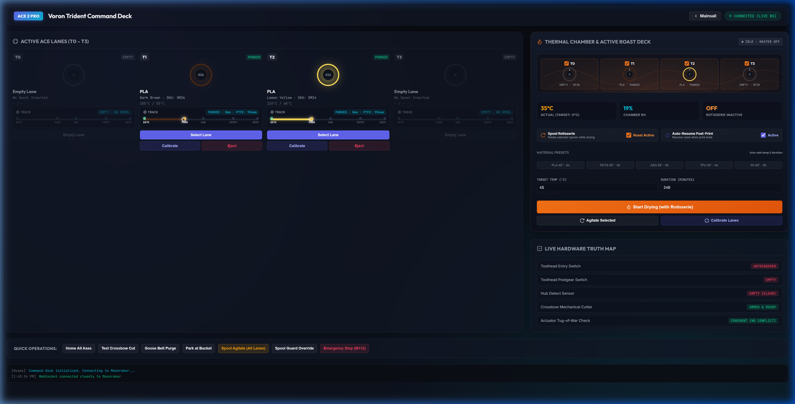
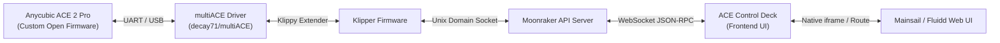
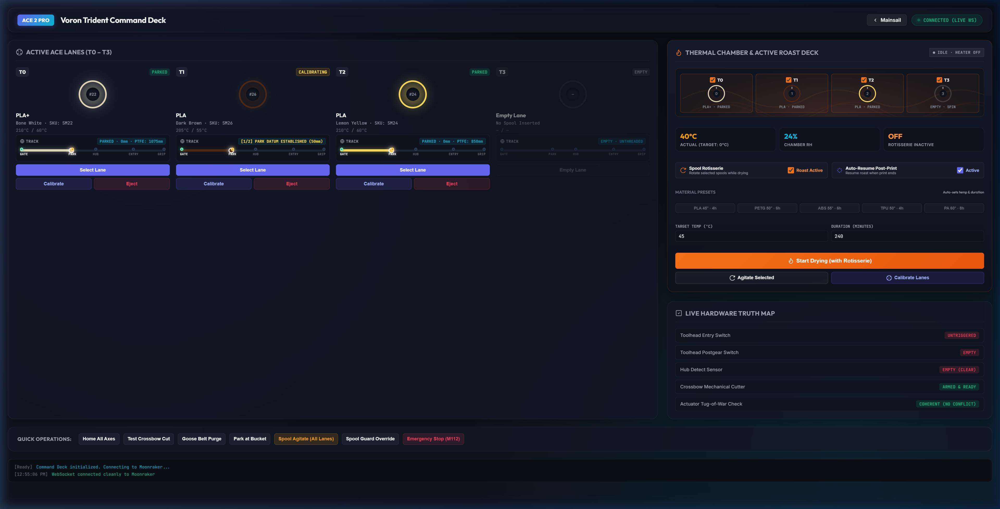
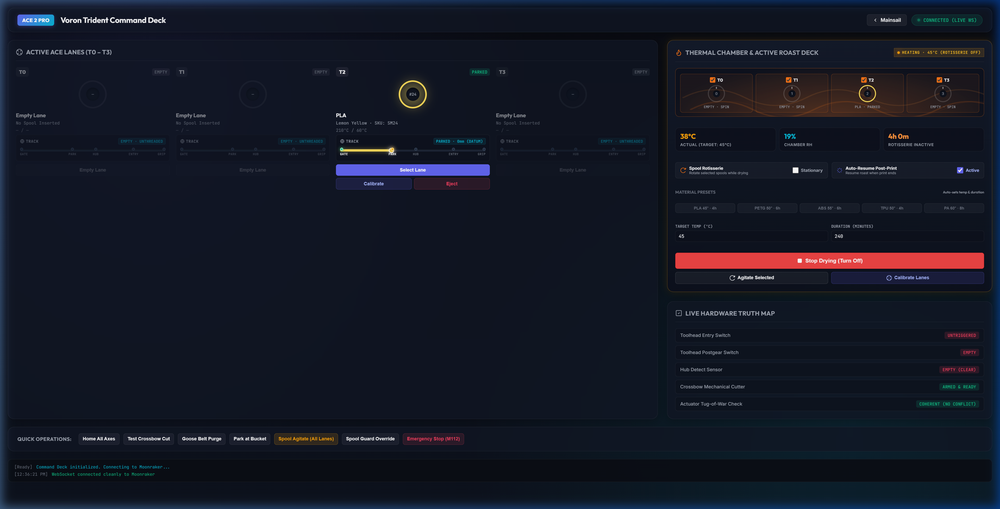
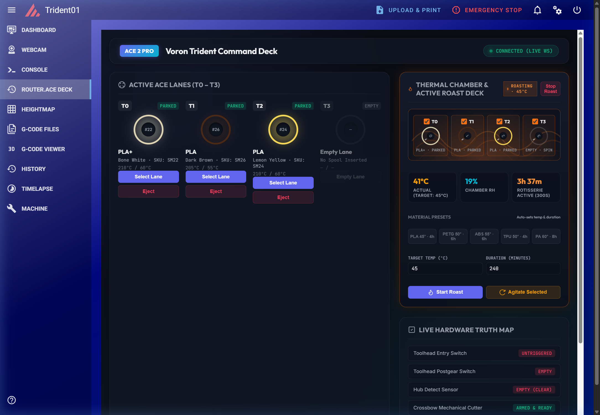
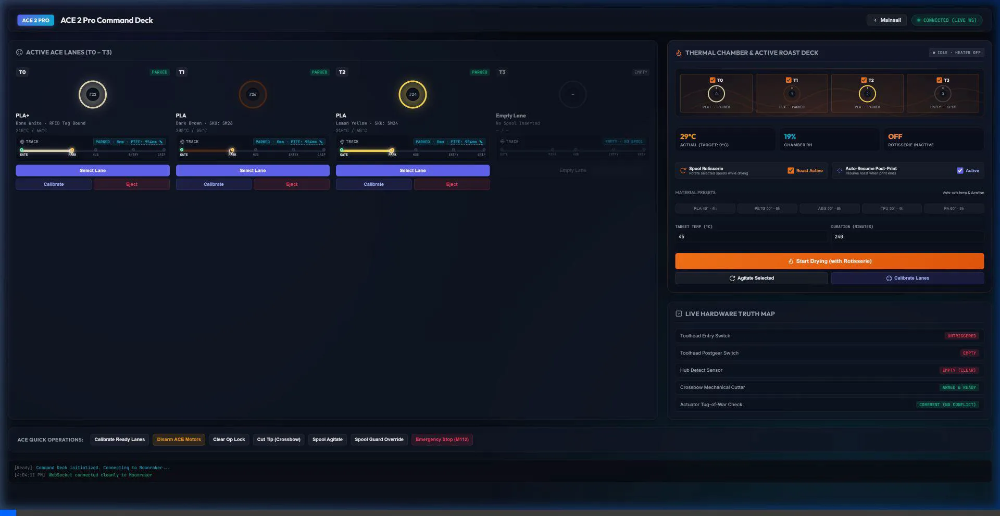
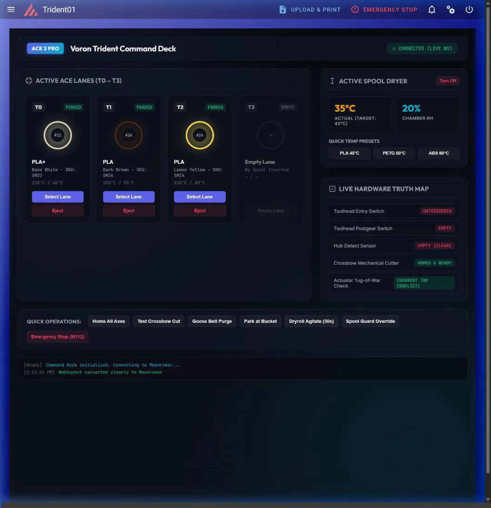

# ACE Control Deck

**The Next-Generation Multi-Material Command Center & Telemetry Visualizer for Klipper**

[](LICENSE)
[](https://github.com/Simon-CR/ace-control-deck)
[](https://www.klipper3d.org/)
[](https://moonraker.readthedocs.io/)
[](https://github.com/decay71/multiACE)

> [!IMPORTANT]
> ### Mandatory Backend Requirement: `decay71/multiACE`
> **ACE Control Deck is strictly the frontend visualization, command dispatch, and telemetry layer.**  
> It **DOES NOT** talk directly to raw hardware or replace the low-level multi-material driver. It strictly requires:
> 1. The **[`multiACE`](https://github.com/decay71/multiACE)** Klipper backend module (by **decay71**) installed and running in your Klipper host environment.
> 2. An **Anycubic ACE 2 Pro** unit flashed with custom open-source firmware compatible with the `multiACE` protocol.
> 
> Stock Anycubic factory firmware does **not** expose Klipper/Moonraker WebSocket APIs. ACE Control Deck reads state objects published by `multiACE` (`printer["ace"]`, `filament_switch_sensor`, `save_variables`). Ensure `multiACE` is operational before installing or running this frontend.

The **ACE Control Deck** is an open-source, production-ready frontend command dashboard and real-time filament telemetry visualizer for the **Anycubic ACE 2 Pro** (and multi-material feeder units) operating within the Klipper ecosystem. 

Engineered with zero build steps, zero npm overhead, and pure responsive HTML5/ES6/CSS3, it communicates directly with Moonraker over low-latency JSON-RPC WebSockets. It can be deployed as an embedded **Mainsail sidebar panel**, a self-hosted **Moonraker static web application**, or a dedicated **standalone touch tablet dashboard**.



---

## Architecture & Ecosystem Overview

ACE Control Deck serves as the graphical command orchestrator and telemetry layer. It connects to the hardware via the **`multiACE`** driver module for Klipper:



- **ACE 2 Pro Hardware**: Custom open-source firmware replaces stock firmware to expose low-level feeder stepper motors, buffer tension sensors, PTC heating elements, and RFID antennas.
- **`multiACE` Driver**: Host-level Klipper module (`klippy/extras/ace.py` by decay71) managing autonomous feeding, lane normalization, toolchanges, and thermal regulation.
- **Klipper & Moonraker**: Dispatches motion primitives and broadcasts printer state objects (`printer["ace"]`, `filament_switch_sensor`, `save_variables`).
- **ACE Control Deck**: Visualizes strand traversal, animates rotisserie drying cycles, performs rolling P95 Bowden calibrations, and dispatches kinematics-safe macros.

---

## Key Features

### 1. Interactive 4-Slot Multi-Material Visualizer
- **Real-Time Lane Telemetry**: Color-coded spools dynamically styled with exact hex codes, brand insignias, material designations (PLA, PETG, ABS, TPU), and remaining weight.
- **Live Filament Strand Animation**: Displays the physical position of filament through the feed path from ACE internal gate, through the park datum, 4-to-1 merger hub, toolhead entry, and extruder post-gear drive.
- **Empty Slot Length & Calibration Display**: Even when a slot is empty or unloaded, the path track retains and displays the calibrated Bowden length and sample badge (`EMPTY · P95: 934mm (10)`).



### 2. Active Dryer & Roast Deck (Rotisserie Agitation)
- **PTC Heater Regulation**: Live chamber temperature graphs, target temperature inputs (35°C – 55°C), and chamber relative humidity (RH%) monitoring.
- **Rotisserie Lane Agitation**: Individual lane toggles (`ROAST` vs. `STATIONARY`). When chamber heating is engaged, selected spools execute periodic oscillating sweeps to guarantee uniform heat penetration and eliminate flat spots or moisture banding.
- **Thermal Convection Animation**: Visual feedback indicating active convective heating versus dormant chambers.

| Thermal Chamber Controls | Mainsail Integrated Roast Deck |
|---|---|
|  |  |

### 3. Rolling P95 Bowden PTFE Calibration
- **Statistical P95 Filtering**: Bowden tube traversal distances are subject to curve friction and mechanical hysteresis. ACE Control Deck calculates and maintains a rolling 95th-percentile (P95) buffer across historical feeds.
- **Single-Click "ONE-SWOOP" Calibration**: Click the `📏 Cal` button on any lane to execute an automated probing sweep (`ACE_CALIBRATE_LANES LANE=X`), which feeds to the toolhead entry switch, establishes the park datum, and recalculates the Bowden length.
- **Interactive Badge & Manual Overrides**: Click the interactive badge (`P95: 934mm ✎`) to manually override tube length, re-seed the calibration datum, or adjust sample buffer sizes (`size=10`).



### 4. Multi-Vendor RFID & NFC Tag Parsing
- **Comprehensive RFID Support**: Built-in parser for Bambu Lab (HKDF-SHA256 authenticated MIFARE Classic tags), Creality CFS, OpenSpool NFC, Anycubic native tags, and Prusament.
- **Spoolman Integration**: Automatically maps spool IDs, manufacturer color names, and minimum/maximum nozzle temperature thresholds from Spoolman databases.

### 5. Kinematics-Agnostic Customizable Macro Templates
- Decoupled from specific printer models. Easily adaptable to **Voron Trident / 2.4**, **Snapmaker U1**, **Creality K1**, **RatRig**, or custom CoreXY/bedslinger architectures.
- Fully configurable macro strings for Load, Unload, Purge, and Nozzle Wipe in the built-in Settings Modal, featuring dynamic placeholder substitution:

| Template Variable | Default Command | Dynamic Placeholders | UI Trigger Action |
|---|---|---|---|
| `MACRO_LOAD` | `ACE_LOAD SLOT={slot}` | `{slot}`, `{lane}`, `{tool}` (0–3) | Slot Card "Select Lane" |
| `MACRO_UNLOAD` | `ACE_UNLOAD SLOT={slot}` | `{slot}`, `{lane}`, `{tool}` (0–3) | Slot Card "Eject" / "Stop" |
| `MACRO_PURGE` | `PURGE` | *(static command)* | Utility Dock "Purge" |
| `MACRO_WIPE` | `CLEAN_NOZZLE` | *(static command)* | Utility Dock "Wipe Nozzle" |

---

## Macro Architecture & Sensor Topology Tiers

ACE Control Deck adapts its visual representation, safety interlocks, and telemetry feed based on your machine's physical sensor topology. For the complete command inventory (~25 commands) and deep architectural mechanics, consult the authoritative [**docs/MACROS_AND_TIERS.md**](docs/MACROS_AND_TIERS.md) guide. Reference macro configurations are provided in [`config/ace_deck_macros_sample.cfg`](config/ace_deck_macros_sample.cfg).

### Sensor Tier Comparison & Macro Behavior

| Tier | Sensor Architecture | Feeding Behavior | Extruder Bite & Toolchange | Runout & Tip Handling |
|:---:|---|---|---|---|
| **Tier 1**<br/>*Minimal* | **1 Hub Sensor**<br/>(`hub_detect`) | **Timed / Blind**. 50mm pre-hub park datum; blind timed push past merger into toolhead. | Unverified gear engagement; longer toolchange cycle (65–90s). | Hub switch runout (~600mm wasted); thermal tip shaping only. |
| **Tier 2**<br/>*Standard* | **1 Hub Sensor** +<br/>**1 Entry Sensor**<br/>(`toolhead_entry`) | **Gated Rapid**. High-speed Bowden transit (85–90 mm/s) stopped dynamically by entry switch. | Sensor confirms arrival at toolhead collet; blind bite into gears. | Entry switch runout (~100mm wasted); thermal shaping or blind cut. |
| **Tier 3**<br/>*High-Reliability*<br/>*(Voron Trident)* | **1 Hub Sensor** +<br/>**2 Toolhead Sensors**<br/>(`toolhead_entry` + `toolhead_postgear`) | **Multi-Stage Ground Truth**. 90 mm/s bulk $\rightarrow$ 30 mm/s funnel $\rightarrow$ 85 mm/s Bowden $\rightarrow$ 15 mm/s bite. | **Verified Bite**. Extruder runs synchronously at 15 mm/s until postgear trips. Sub-35s toolchange. | **Zero-Waste Runout**. Postgear cut witness verifies mechanical blade cut (CROSSBOW). |

> [!IMPORTANT]
> **Physical Hardware Invariant**: Anycubic ACE 2 Pro **strictly requires at least Tier 1 (Hub Sensor)**. Without a hub switch, multiple lanes cannot reliably park clear of the 4-to-1 merger, resulting in catastrophic filament collisions inside the junction block.

- Detailed Macro & Tier Architecture Guide: [**docs/MACROS_AND_TIERS.md**](docs/MACROS_AND_TIERS.md)
- Voron Trident 300 Integration Guide: [**docs/MULTIACE_ON_VORON_TRIDENT.md**](docs/MULTIACE_ON_VORON_TRIDENT.md)
- Reference Klipper Configuration: [`config/ace_deck_macros_sample.cfg`](config/ace_deck_macros_sample.cfg)

---

## Prerequisites & Installation Methods

### Mandatory Prerequisites
Before installing the ACE Control Deck, ensure your system meets the following requirements:
1. **multiACE Module**: Install and verify [`decay71/multiACE`](https://github.com/decay71/multiACE) in your Klipper installation.
2. **ACE 2 Pro Custom Firmware**: Flash the open-source firmware to the ACE 2 Pro mainboard to expose Moonraker/Klipper API communication.
3. **Klipper & Moonraker**: Standard operational Klipper installation with Moonraker WebSocket API accessible on your local network.

---

### Method 1: Drop-in Single-File Web App (Standalone / Tablet)

Because ACE Control Deck is a self-contained single-page application, you can run it anywhere without compilation:

1. Download [`index.html`](index.html).
2. Open it in Chrome, Firefox, or Safari on your workstation, mobile phone, or a dedicated touchscreen tablet (e.g. iPad, Raspberry Pi Touch Display, or Android tablet).
3. Click the **Settings (Gear)** icon in the upper right.
4. Enter your Moonraker host IP and port (e.g., `<printer-ip>:7125`) and click **Save Settings**.
5. *Optional*: You can also bookmark the URL with the host parameter pre-configured:
   ```
   file:///path/to/index.html?host=<printer-ip>:7125
   ```

---

### Method 2: Moonraker Static File Hosting

Host the application directly from the Raspberry Pi / CM4 powering your 3D printer:

1. SSH into your printer's host computer:
   ```bash
   cd ~
   git clone https://github.com/Simon-CR/ace-control-deck.git
   ```
2. Open `~/printer_data/config/moonraker.conf` in an editor and add a static file endpoint:
   ```ini
   [static_file_path ace_deck]
   path: ~/ace-control-deck
   ```
3. Restart Moonraker:
   ```bash
   sudo systemctl restart moonraker
   ```
4. Access the dashboard from any browser on your local network:
   ```
   http://<printer-ip>:7125/ace_deck/index.html
   ```

---

### Method 3: Native Mainsail Sidebar Integration

Integrate ACE Control Deck directly into the Mainsail navigation sidebar as a native tab with zero iframe flicker:



1. Clone the repository to your host:
   ```bash
   cd ~
   git clone https://github.com/Simon-CR/ace-control-deck.git
   ```
2. Run the included automated patcher script:
   ```bash
   cd ~/ace-control-deck/scripts
   ./install.sh
   ```
   *(If Mainsail is located in a custom path, pass `--mainsail-path ~/custom_mainsail_path`)*
3. The script automatically:
   - Copies `index.html` into Mainsail's web root (`~/mainsail/ace/index.html`).
   - Injects the `/acedeck` route and sidebar icon into Mainsail's compiled bundle.
   - Bumps Mainsail's Service Worker cache (`sw.js`) so your browser immediately displays the new tab.
4. Hard-refresh your browser (`Ctrl+Shift+R` or `Cmd+Shift+R`). You will see **ACE Deck** in the sidebar.

---

## Moonraker Update Manager Configuration

To receive continuous one-click updates directly from the Mainsail / Fluidd Machine settings panel, append the following block to your `moonraker.conf`:

```ini
[update_manager ace-control-deck]
type: git_repo
path: ~/ace-control-deck
origin: https://github.com/Simon-CR/ace-control-deck.git
primary_branch: master
is_system_service: False
```

---

## Configuration & Settings Modal

Click the **Gear Icon** in the top navigation bar to access runtime settings:

- **Moonraker Host**: Specify the target host/IP and port (e.g. `127.0.0.1:7125` or `<printer-ip>:7125`).
- **Sensor Topology**: Select `Auto`, `Tier 1 (Minimal)`, `Tier 2 (Standard)`, or `Tier 3 (High-Reliability Voron)`.
- **Sensor Object Bindings**:
  - `Hub Sensor`: Default `filament_switch_sensor hub_detect`
  - `Entry Sensor`: Default `filament_switch_sensor toolhead_entry`
  - `Post-Gear Sensor`: Default `filament_switch_sensor toolhead_postgear`
- **Custom Macro Dispatch Templates**:
  - `Load Macro`: e.g. `ACE_LOAD SLOT={slot}` or `T{slot}`
  - `Unload Macro`: e.g. `ACE_UNLOAD SLOT={slot}` or `ACE_RETRACT T={slot}`
  - `Purge Macro`: e.g. `PURGE` or `G1 E30 F300`
  - `Nozzle Wipe Macro`: e.g. `CLEAN_NOZZLE` or `WIPE_LINE`

All settings are persisted in browser `localStorage` and take effect immediately without requiring a browser reload. Reference macro definitions are provided in [`config/ace_deck_macros_sample.cfg`](config/ace_deck_macros_sample.cfg).

---

## Hardware Invariants & Physical Operational Rules

When operating the Anycubic ACE 2 Pro with Klipper, observe the following physical hardware invariants:

1. **Clamped Idle Lanes**:
   Unlike simple multi-spool holders that freewheel, idle feeder lanes in the ACE 2 Pro mechanically clamp their drive rollers when unselected. Never attempt to manually yank filament from an unselected lane while another lane is active. Always call `ACE_LANE_NORMALIZE` or select the lane before retraction.
2. **Direction-Blind Rotary Hub Encoder**:
   The internal RDM hub encoder emits quadrature pulses confirming linear movement, but is direction-blind. Firmware must never determine direction of travel from encoder pulses alone; rely strictly on switch transitions (`hub_detect`, `toolhead_entry`, `toolhead_postgear`) to confirm transit phase.
3. **Thermal Safety & Cold-Side Travel Interlocks**:
   Cold-side filament advance must terminate strictly at `toolhead_postgear`. Pushing past the post-gear switch into the hotend melt zone is physically interlocked: the hotend must be at or above `min_extrude_temp` (e.g., 180°C) before any further extrusion move is permitted.

---

## Contributing & License

Contributions, issue reports, and feature proposals are welcome! Please ensure all code additions maintain LF line endings and pass syntax validation.

This project is licensed under the **GNU General Public License v3.0**. See the [LICENSE](LICENSE) file for complete terms.
