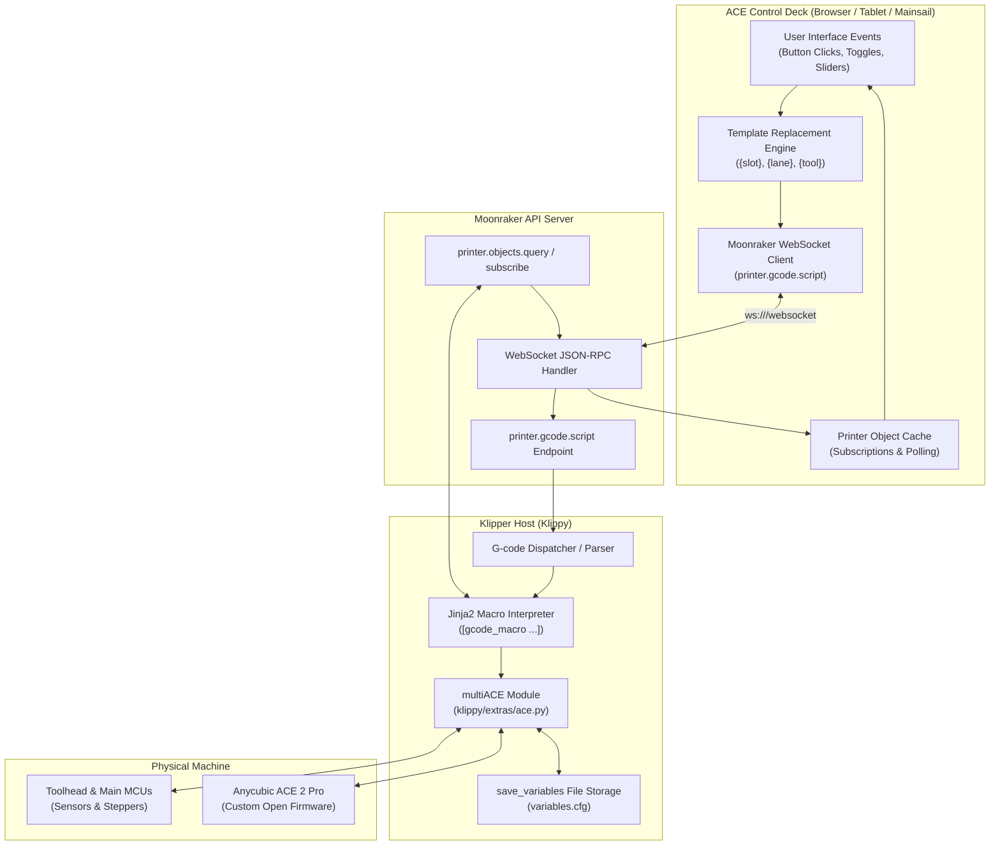

# Macro Architecture & Sensor Tier Guide

An authoritative technical reference for the macro dispatch engine, command inventory, and sensor topology tiers in **ACE Control Deck** and **multiACE**.

---

## 1. Executive Macro Architecture

ACE Control Deck is engineered as a zero-compilation, low-overhead frontend visualizer that interfaces with Klipper exclusively through **Moonraker's JSON-RPC WebSocket API**. 



### Communication Flow
1. **Command Dispatch**: When a user clicks an action in the deck (e.g. "Select Lane", "Calibrate", "Roast"), the deck formats the command string using its template engine and sends a JSON-RPC message to Moonraker:
   ```json
   {
     "jsonrpc": "2.0",
     "method": "printer.gcode.script",
     "params": {
       "script": "ACE_LOAD SLOT=0"
     },
     "id": 1042
   }
   ```
2. **Klipper Execution**: Moonraker forwards the script string over the Unix domain socket to Klippy. Klippy's macro interpreter parses the command, executes any custom G-code or Jinja2 logic in `printer.cfg`, and delegates hardware motion to `multiACE`.
3. **Reactive State Feedback**: As sensors trip and motor steps advance, Klipper updates its internal printer objects (`printer["ace"]`, `filament_switch_sensor`, `save_variables`). Moonraker streams these state updates over the WebSocket subscription, allowing ACE Control Deck to reactively update strand visuals, lane badges, and temperature graphs.

---

## 2. Action Templates & Supported Placeholders

To remain strictly rig-agnostic, ACE Control Deck does not hardcode printer-specific motion commands into its primary UI buttons. Instead, it exposes four **Action Templates** in the **Settings Modal** (accessible via the Gear icon in the top navigation bar):

| Template Setting | Default Template | Primary UI Trigger | Purpose |
|---|---|---|---|
| `MACRO_LOAD` | `ACE_LOAD SLOT={slot}` | **"Select Lane"** button on slot card | Dispatches filament load from the selected slot to the toolhead. |
| `MACRO_UNLOAD` | `ACE_UNLOAD SLOT={slot}` | **"Eject"** / **"Stop / Eject"** button | Dispatches filament retraction from the toolhead to the park datum. |
| `MACRO_PURGE` | `PURGE` | **"Purge"** utility button | Extrudes molten filament to prime nozzle or clear color transitions. |
| `MACRO_WIPE` | `CLEAN_NOZZLE` | **"Wipe Nozzle"** utility button | Executes nozzle scrubbing moves across brush or purge bucket. |

> [!NOTE]
> **Dynamic Button Visibility**: The `PURGE` and `CLEAN_NOZZLE` buttons automatically query Moonraker for `printer["gcode_macro " + MACRO_NAME]`. If the macro does not exist in your Klipper configuration, the button is cleanly suppressed to prevent dispatching unknown commands.

### Supported Template Placeholders

When `MACRO_LOAD` or `MACRO_UNLOAD` is dispatched, the deck's template engine parses the string and substitutes any occurrence of the following case-insensitive placeholders with the zero-indexed lane index (`0`, `1`, `2`, or `3`):

- **`{slot}`**: Standard multiACE slot index (`0`–`3`).
  - Example: `ACE_LOAD SLOT={slot}` $\rightarrow$ `ACE_LOAD SLOT=2`
- **`{lane}`**: Semantic alias for slot index.
  - Example: `ACE_FEED LANE={lane}` $\rightarrow$ `ACE_FEED LANE=2`
- **`{tool}`**: Standard Klipper toolchange / extruder index.
  - Example: `T{tool}` $\rightarrow$ `T2`

### Template Mapping Examples Across Different Rigs

- **Standard multiACE Setup**:
  - `MACRO_LOAD` = `ACE_LOAD SLOT={slot}`
  - `MACRO_UNLOAD` = `ACE_UNLOAD SLOT={slot}`
- **Direct Toolchange Mapping (Voron / OrcaSlicer shims)**:
  - `MACRO_LOAD` = `T{tool}`
  - `MACRO_UNLOAD` = `ACE_UNLOAD SLOT={slot}`
- **Snapmaker U1 Extended Architecture**:
  - `MACRO_LOAD` = `T{tool}`
  - `MACRO_UNLOAD` = `U1_EJECT_LANE LANE={lane}`
- **Happy Hare / MMU Compatible Wrapper**:
  - `MACRO_LOAD` = `MMU_CHANGE_TOOL TOOL={tool}`
  - `MACRO_UNLOAD` = `MMU_EJECT`

---

## 3. Complete Macro Command Inventory

ACE Control Deck dispatches approximately 25 distinct commands across 6 functional categories. Below is the comprehensive command reference:

### Category 1: Action Templates & Lane Selection

| Command | Arguments | Dispatched By | Operational Description |
|---|---|---|---|
| `ACE_LOAD` | `SLOT={0..3}` | Slot Card "Select Lane" | Dispatches toolhead loading for the specified slot using the configured template. |
| `ACE_UNLOAD` | `SLOT={0..3}` | Slot Card "Eject" | Retracts the active strand back to the park datum. |
| `PURGE` | *(none)* | Dock Utility "Purge" | Extrudes a fixed volume (e.g. 20–35 mm) of filament to prime the hotend. |
| `CLEAN_NOZZLE` | *(none)* | Dock Utility "Wipe" | Executes mechanical brush passes across the nozzle. |

### Category 2: Filament Staging & Motion

| Command | Arguments | Dispatched By | Operational Description |
|---|---|---|---|
| `ACE_LANE_NORMALIZE` | `[T={0..3}]` | "Normalize Lanes" button | Retracts the specified lane (or all lanes if `T` omitted) to the standard Park Datum (50 mm upstream of the hub switch). Essential before toolchanges. |
| `ACE_LANE_PARK` | `T={0..3}` | Track "Park" button | Parks the specified lane at the calibrated park datum. |
| `ACE_LANE_EJECT` | `T={0..3} FORCE=1` | "Force Eject" button | Retracts filament all the way out of the reverse Bowden tube and 4-to-1 merger back into the ACE unit spool bay. `FORCE=1` bypasses sensor stall guards. |
| `ACE_DEBUG_SET_CURRENT_INDEX` | `TOOL={0..3}` | "Claim Loaded" button | Overrides internal driver state to assign toolhead ownership to a specific lane if state desynchronizes after manual intervention. |

### Category 3: PTFE Calibration & History

| Command | Arguments | Dispatched By | Operational Description |
|---|---|---|---|
| `ACE_CALIBRATE_LANES` | `LANE={0..3}` | "📏 Cal" button | Initiates a physical "ONE-SWOOP" measurement sweep: feeds filament from the park datum to the toolhead entry switch, updates rolling P95 history, and re-parks. |
| `ACE_SET_PTFE_LENGTH` | `T={0..3} LENGTH={mm}` | PTFE Badge Edit Prompt | Manually sets the Bowden tube length for the specified lane and resets/seeds the P95 history buffer with this value. Valid range: 300–2500 mm. |
| `ACE_RESET_PTFE_HISTORY` | `T={0..3}` | PTFE Badge Prompt (`reset`) | Clears the rolling sample history for the lane and re-seeds it with the current active length. |
| `ACE_PTFE_HISTORY` | `SIZE={int}` | PTFE Badge Prompt (`size=XX`) | Configures the rolling window sample size (e.g. `size=10` or `size=20`) stored in `save_variables`. |

### Category 4: Active Dryer & Roast Deck

| Command | Arguments | Dispatched By | Operational Description |
|---|---|---|---|
| `ACE_ROAST` | `LANES={0,1..} TEMP={C} MINUTES={m}` | Roast Deck "Start Roast" | Engages PTC chamber heating while simultaneously executing periodic oscillating rotisserie sweeps on all checked lanes. |
| `ACE_START_DRYING` | `TEMP={C} DURATION={m}` | Dryer Deck "Start Drying" | Engages PTC heating elements for stationary drying without rotating the feeder rollers. |
| `ACE_ROAST_STOP` | *(none)* | Roast Deck "Stop" | Stops active roasting cycles, disengages roller agitation, and shuts off PTC heaters. |
| `ACE_DRYROLL_STOP` | *(none)* | Emergency stop / Eject | Immediately stops feeder roller agitation motors while leaving heaters intact. |
| `ACE_STOP_DRYING` | *(none)* | Dryer Deck "Stop" | Disengages chamber heating elements. |
| `ACE_ROAST_SET_LANE` | `T={0..3} ACTIVE={0\|1}` | Lane "ROAST" toggle | Toggles whether an individual lane participates in rotisserie rotation during heating cycles. |
| `ACE_ROAST_AGITATE` | `LANES={0,1..}` | "Test Agitate" button | Executes a brief 10-second forward/reverse roller jog to test mechanical spool engagement. |
| `ACE_AUTODRY` | `TARGET_RH={%} TEMP={C} INTERVAL={m}` | Auto-Dry Settings modal | Configures automated background drying: triggers heater when chamber relative humidity exceeds threshold. |
| `ACE_DRY_OFF` | *(none)* | Auto-Dry Toggle (Off) | Disables automated background humidity monitoring and turns off heaters. |
| `ACE_DRYROLL_SET_AUTORESUME` | `ENABLE={0\|1}` | Auto-Resume Toggle | Configures whether drying cycles automatically resume after print completion. |

### Category 5: Spool Identification & FilaMan

| Command | Arguments | Dispatched By | Operational Description |
|---|---|---|---|
| `MMU_GATE_MAP` | `GATE={0..3} SPOOLID={id} MATERIAL="{mat}" COLOR="{hex}" NAME="{name}" [TEMP={C}]` | Spool Selector Modal | Maps Spoolman database ID, material type, hex color, and temperature settings to the specified slot. |
| `MMU_GATE_MAP` | `GATE={0..3} SPOOLID=-1 MATERIAL="" COLOR="" NAME=""` | "Unassign Spool" button | Clears spool assignment metadata from the slot. |
| `ACE_ENABLE_ENDLESS_SPOOL` | *(none)* | Endless Spool Toggle | Enables automatic failover to a designated backup slot when the active spool runs out. |
| `ACE_DISABLE_ENDLESS_SPOOL` | *(none)* | Endless Spool Toggle | Disables automatic spool failover; printer pauses on runout. |
| `ACE_SET_SLOT_BACKUP` | `SLOT={0..3} BACKUP={0..3}` | Slot Backup Selectors | Binds an active slot to an identical material backup slot for seamless runout transition. |
| `ACE_RUNOUT_MODE` | `MODE=prompt\|backup` | Runout Policy Selector | Configures whether runout prompts user for action or switches immediately to backup spool. |
| `ACE_SET_ENDLESS_SPOOL_MODE`| `MODE={int}` | Mode Selectors | Sets low-level endless spool operational policy in driver. |

### Category 6: Emergency & Safety Controls

| Command | Arguments | Dispatched By | Operational Description |
|---|---|---|---|
| `ACE_CLEAR_OP` | *(none)* | "Clear Op Lock" button | Clears persistent `ace_op` lock in `save_variables` if a print or toolchange was aborted mid-motion, restoring user control. |
| `ACE_RAW_STOP` | `T={0..3}` | Emergency Feeder Disarm | Directly disarms and cuts power to the internal feeder stepper motors across all four lanes. |
| `M112` | *(none)* | "Emergency Stop" button | Standard Klipper emergency shutdown. Immediately halts all heaters, steppers, and operations. |

---

## 4. Sensor Tier Comparison Matrix & Detailed Macro Behavior

The physical sensor configuration defines what the macro engine can physically verify versus what it must execute blindly.

```mermaid
flowchart TD
    subgraph Tier1["Tier 1: Minimal (1 Hub Sensor)"]
        T1_ACE["ACE Feeder"] -->|~904–954mm| T1_Hub["Hub Sensor (hub_detect)"]
        T1_Hub -.->|555.9mm (Blind Timed Feed)| T1_Nozzle["Hotend Nozzle"]
    end

    subgraph Tier2["Tier 2: Standard (Hub + Toolhead Entry)"]
        T2_ACE["ACE Feeder"] -->|~904–954mm| T2_Hub["Hub Sensor (hub_detect)"]
        T2_Hub -->|555.9mm Rapid Transit| T2_Entry["Entry Sensor (toolhead_entry)"]
        T2_Entry -.->|20mm (Blind Gear Bite)| T2_Extruder["Extruder Gears"]
    end

    subgraph Tier3["Tier 3: High-Reliability Voron (Hub + Entry + Postgear)"]
        T3_ACE["ACE Feeder"] -->|~904–954mm| T3_Hub["Hub Sensor (hub_detect)"]
        T3_Hub -->|555.9mm Rapid Transit (85 mm/s)| T3_Entry["Entry Sensor (toolhead_entry)"]
        T3_Entry -->|20mm Synchronous Bite (15 mm/s)| T3_Gears["Extruder Gears"]
        T3_Gears -->|Bite & Cut Witness| T3_Post["Post-Gear Sensor (toolhead_postgear)"]
        T3_Post -->|80mm Purge / Extrude| T3_Nozzle["Hotend Nozzle"]
    end
```

### Detailed Comparison Matrix

| Architectural Dimension | Tier 1: Minimal | Tier 2: Standard | Tier 3: High-Reliability (Voron) |
|---|---|---|---|
| **Sensor Complement** | 1 Hub Switch (`hub_detect`) | 1 Hub Switch + 1 Toolhead Entry Switch (`toolhead_entry`) | 1 Hub Switch + 1 Entry Switch + 1 Post-Gear Switch (`toolhead_postgear`) |
| **Park Datum** | 50 mm before Hub Switch | 50 mm before Hub Switch | 50 mm before Hub Switch (or Cold-Park at Postgear) |
| **Reverse Bowden Feeding** | Blind timed extrusion past hub (risk of compression/jamming). | High-speed rapid transit (85–90 mm/s) stopped dynamically by `toolhead_entry`. | High-speed transit to entry switch, followed by multi-stage deceleration. |
| **Extruder Gear Engagement** | Blind feed; hope teeth bite without chewing filament. | Sensor confirms arrival at inlet; blind bite into gears. | **Confirmed Bite**: Extruder feeds at 15 mm/s synchronously until `toolhead_postgear` trips. Zero slip. |
| **Tip Management & Cutting** | Thermal tip shaping only. | Thermal shaping or unverified mechanical cut. | **Cut Witness**: `toolhead_postgear` verifies tip severed from strand before Bowden retract. |
| **Runout Handling** | Hub switch trips $\rightarrow$ print must pause with ~600 mm of filament wasted. | Entry switch trips $\rightarrow$ print pauses with only ~100 mm wasted. | **Zero-Waste Runout**: Extruder prints until `toolhead_postgear` clears, utilizing entire Bowden length. |
| **Typical Toolchange Duration** | 65 – 90 seconds | 45 – 60 seconds | **28 – 38 seconds** |

---

## 5. Sample Macro Configuration Guide

A ready-to-use template configuration is provided in [`config/ace_deck_macros_sample.cfg`](../config/ace_deck_macros_sample.cfg). 

### Adapting for Non-Voron Rigs

#### 1. Snapmaker U1
- **Hardware Profile**: CoreXY with enclosed gantry, single toolhead runout switch, custom toolchange wipe bucket.
- **Sensor Mapping**: Map the toolhead runout switch to `toolhead_entry` (`Tier 2 Standard`).
- **Macro Customization**:
  ```ini
  [gcode_macro ACE_LOAD]
  gcode:
      
      T{slot}
  
  [gcode_macro PURGE]
  gcode:
      # Use Snapmaker U1 nozzle wipe bucket
      G1 X20 Y220 F9000
      G1 E30 F300
  ```

#### 2. Creality K1 / K1 Max
- **Hardware Profile**: CoreXY with rear frame silicone wiper, shorter reverse Bowden path (~720 mm).
- **PTFE Calibration**: Run `ACE_CALIBRATE_LANES LANE=0` to establish the shorter ~720 mm Bowden datum.
- **Macro Customization**:
  ```ini
  [gcode_macro CLEAN_NOZZLE]
  gcode:
      # K1 rear wiper scrub sequence
      G1 X210 Y225 F12000
      G1 X240 Y225 F12000
      G1 X210 Y225 F12000
  ```

#### 3. Bedslingers / Prusa-Style Rigs
- **Path Consideration**: Reverse Bowden tube length varies as toolhead travels along X and Z.
- **P95 Recommendation**: Ensure `ace_cal_ptfe_history_size` is set to at least 15 (`ACE_PTFE_HISTORY SIZE=15`) so the rolling P95 filter accounts for worst-case Bowden flexion at maximum Z height.
