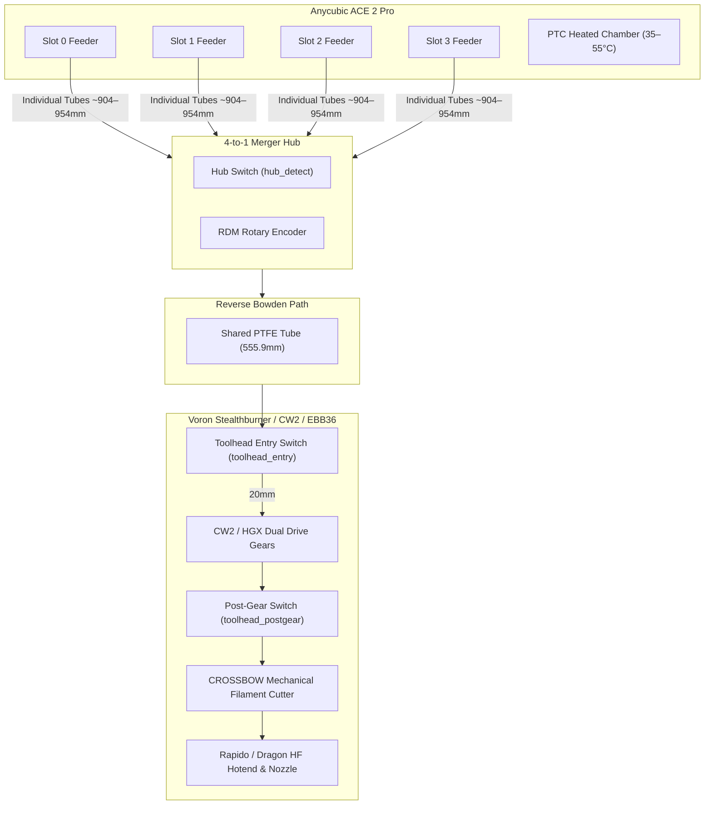

# multiACE on Voron Trident 300 Integration Guide

An authoritative engineering and configuration guide for integrating the **Anycubic ACE 2 Pro** multi-material system with a **Voron Trident 300 CoreXY** 3D printer running **Klipper**, **multiACE**, and the **ACE Control Deck**.

> [!IMPORTANT]
> ### Core Architecture Prerequisite: `decay71/multiACE`
> This integration relies fundamentally on the **[`multiACE`](https://github.com/decay71/multiACE)** Klipper backend module authored by **decay71**, operating in tandem with open-source custom firmware on the ACE 2 Pro hardware.
> 
> The **ACE Control Deck** provides the UI visualization and telemetry layers atop `multiACE`'s low-level kinematic engine. Stock Anycubic firmware is not supported. Ensure `multiACE` is installed and communicating with your ACE 2 Pro before setting up toolchange macros.

---

## 1. Architectural & Kinematic Overview

The **Voron Trident 300** presents a unique kinematic profile for multi-material automation compared to flying-gantry printers (like the Voron 2.4):

- **Z-Axis Invariant Bed Kinematics**: In a Voron Trident, the XY gantry is rigidly anchored at the top of the frame, while the bed moves exclusively in the Z axis via 3 lead screws. 
- **Planar XY Toolchanges & Purge Operations**: Because the gantry does not lift away from the bed during a print pause or toolchange without moving the bed itself (which can induce thermal layer shifting or nozzle drool), toolchange paths, tip-cutting moves, and nozzle wipes must execute strictly in XY coordinates.
- **Fixed-Height Purge Bucket & Nozzle Brush**: The purge bucket and silicone brush / brass wire scrub assembly are typically mounted on the rear frame extrusions (e.g., $X=35, Y=305$ to $X=95, Y=305$). Toolchange sequences must park at a deterministic XY location without requiring Z hops that might collide with tall prints.



---

## 2. Measured Filament Path Geometry

Precision filament feeding requires exact segment boundaries to eliminate grinding, prevent jams, and avoid under-purging. Below are the physical measurements established and verified on the Voron Trident 300:

| Path Segment | Physical Distance | Klipper Variable / Parameter | Operational Description |
|---|---|---|---|
| **ACE Feeder to Hub Switch** | **~904 – 954 mm** | `ace_cal_park_to_hub` | Individual PTFE tubes from ACE internal gates to the 4-to-1 merger. Lane variations: T0: 934 mm, T1: 944 mm, T2: 954 mm, T3: 904 mm nominal. |
| **Park Datum** | **Hub Switch $- 50\text{ mm}$** | `ace_park_offset` | Standard staged parking position. Keeps the filament retracted 50 mm outside the 4-to-1 junction to allow unobstructed passage for other lanes. |
| **Hub to Toolhead Entry** | **555.9 mm** | `ace_cal_hub_to_entry` | Shared reverse Bowden tube from the 4-to-1 merger output collet to the toolhead inlet collet. |
| **Toolhead Entry to Postgear** | **20.0 mm** | `ptfe_entry_to_postgear` | Internal guide path inside the extruder body spanning from the entry switch lever, through the dual-drive drive gears, to the post-gear switch. |
| **Postgear to Cutter Blade** | **5.6 mm** | `crossbow_postgear_to_blade` | Mechanical distance between the post-gear switch trigger point and the cutting blade edge of the CROSSBOW cutter. |
| **Blade Edge to Nozzle Tip** | **46.1 mm** | `crossbow_blade_to_nozzle` | Geometric distance from the cutter blade down through the heatbreak and melt zone to the nozzle orifice ($5.6 + 46.1 = 51.7\text{ mm}$ total geometric postgear-to-nozzle). |
| **Postgear to Nozzle (Functional)** | **80.0 mm** | `ptfe_postgear_to_nozzle` | Functional extrusion distance from post-gear engagement to observed molten flow at the nozzle tip (accounts for melt zone compression and lead). |


> [!IMPORTANT]
> **Functional Purge vs. Geometric Distance**:
> Do not confuse `ptfe_postgear_to_nozzle` (80.0 mm functional purge stroke) with the physical cutter geometry (51.7 mm). Using 51.7 mm for purge calculations results in severe under-priming and hollow extrusion lines on the purge tower.

---

## 3. CAN Toolhead Sensor Setup (BTT EBB36 v1.2 / SB2209)

The Voron Trident uses a BigTreeTech **EBB36 v1.2** CAN toolhead board communicating over `can0` at 1 Mbps via a BTT U2C USB-to-CAN bridge.

### Hardware Wiring & Pin Mapping

```
EBB36 v1.2 Toolhead Board:
  • PA15 (Endstop 1 / Diagnostic Header) -> Toolhead Entry Switch
  • PD0  (Endstop 2 Header)               -> Toolhead Postgear Switch

Main MCU (e.g. BTT Manta M8P / Octopus):
  • PC15 (or PF0)                         -> 4-to-1 Hub Merger Switch
```

### Klipper Configuration (`toolhead.cfg`)

```ini
# =========================================================================
# TOOLHEAD ENTRY SENSOR
# Located above extruder gears; detects arrival from Bowden tube
# =========================================================================
[filament_switch_sensor toolhead_entry]
switch_pin: ^!ebb36:PA15
pause_on_runout: False
event_delay: 0.5
insert_gcode:
    
    
    
        M118 [SENSOR] Filament Inserted (Entry) - Managed by multiACE
    
        M118 [SENSOR] Filament Inserted (Entry) - Manual Feed
    
runout_gcode:
    
    
        M118 [SENSOR] Entry cleared during toolchange (Expected)
    
        M118 [SENSOR] Tail reached toolhead entry - handing over to runout handler
        UPDATE_DELAYED_GCODE ID=_ACE_RUNOUT_FALLBACK DURATION=5
    

# =========================================================================
# TOOLHEAD POST-GEAR SENSOR
# Located directly beneath extruder drive gears; confirms gear bite
# =========================================================================
[filament_switch_sensor toolhead_postgear]
switch_pin: ^!ebb36:PD0
pause_on_runout: False
event_delay: 1.0
runout_gcode:
    
    
        M118 [SENSOR] FILAMENT EXHAUSTED AT POSTGEAR!
        PAUSE
    

# =========================================================================
# 4-TO-1 HUB MERGER SENSOR (Main MCU)
# Located at junction of 4-to-1 merger
# =========================================================================
[filament_switch_sensor hub_detect]
switch_pin: ^!PC15
pause_on_runout: False
```

### Sensor Truth Table & Segment Ownership

| `hub_detect` | `toolhead_entry` | `toolhead_postgear` | Filament Physical Location | Actuator Ownership | Motion Action |
|:---:|:---:|:---:|---|---|---|
| **0** | **0** | **0** | Parked inside ACE unit | ACE Feeder | Idle or initial lane advance |
| **1** | **0** | **0** | Transiting Reverse Bowden | **ACE Feeder Alone** | Fast Bowden transit (85 mm/s) toward toolhead |
| **1** | **1** | **0** | Reached toolhead inlet collet | **ACE Feeder + Extruder Assist** | Funnel entry (30 mm/s) & bite engagement (15 mm/s) |
| **1** | **1** | **1** | Fully loaded through extruder | **Extruder Motor** (ACE Rollback Assist on retract) | Printing / Extruding |
| **0** | **1** | **1** | Spool runout; tail past hub | **Extruder Motor** | Infinite spool switchover or runout pause |
| **0** | **0** | **1** | Stub left in toolhead / hotend | None (Hazard) | Cut stub stuck; requires manual ejection or purge |

---

## 4. Multi-Stage Feeding Speed Profile

To achieve sub-45-second toolchanges without skipping feeder steps or grinding filament, the loading sequence operates across four distinct speed regimes:

```
[ ACE Unit ]  == 90 mm/s ==>  [ 4-to-1 Hub ]  == 85 mm/s ==>  [ Entry Switch ]  == 30 mm/s ==>  [ Gears ]  == 15 mm/s ==>  [ Postgear ]
    (Bulk Transit)                (Bowden High-Speed)           (Funnel Decel)               (Bite Engage)
```

1. **Bulk Transit (90 mm/s)**:
   - Feeds filament from the internal spool bay through the primary guide tube.
   - High velocity safely handles the straight, unobstructed individual lane tube.
2. **Funnel Approach (30 mm/s)**:
   - Decelerates 20 mm prior to the 4-to-1 merger hub switch.
   - Ensures smooth entrance into the merger cone without catching on internal lips.
3. **Bowden Transit (85 mm/s)**:
   - High-speed traversal through the 555.9 mm shared reverse Bowden tube.
   - Decelerates upon triggering `toolhead_entry`.
4. **Bite Engagement (15 mm/s)**:
   - Low-speed, high-torque feed while the toolhead extruder motor runs synchronously at 15 mm/s.
   - Guarantees immediate, positive tooth bite on the filament without shaving or flattening the tip.
   - Stops the moment `toolhead_postgear` triggers.

---

## 5. Tip Forming vs. Mechanical Cutting (CROSSBOW)

On a high-speed Voron Trident, **mechanical cutting** is strongly preferred over thermal tip forming:

| Feature | Thermal Tip Shaping (Ramming / Dip) | Mechanical Cutting (CROSSBOW / ERCF Cutter) |
|---|---|---|
| **Cycle Time** | 8 – 14 seconds (dwell, push, pull, wait) | **1.8 – 2.5 seconds** (rapid XY lever compression) |
| **Reliability** | ~96% (susceptible to strings and swollen ends) | **99.8%** (clean, crisp, cylindrical flat face) |
| **Hotend Compatibility** | High-flow hotends form large blobs in heatbreak | Universal (Dragon, Rapido, UHF, Revo) |
| **Multi-Material Swaps** | Strings easily jam 4-to-1 hub switch | Zero strings; tip cleanly retracts through merger |

### CROSSBOW Cutting Parameters

```ini
[gcode_macro CROSSBOW_CUT_TIP]
description: Mechanical tip cutting on Voron Trident
gcode:
    SAVE_GCODE_STATE NAME=STATE_CROSSBOW_CUT
    G90
    # 1. Retract filament 38.1mm to align cutting zone with blade
    G1 E-38.1 F3000
    # 2. Rapid traverse to cut pin on rear frame extrusion
    G1 X18 Y305 F24000
    # 3. Compress cutter lever against frame stop
    G1 X-4 F6000
    G4 P250
    # 4. Release cutter
    G1 X18 F12000
    # 5. Cold retract past toolhead_entry
    G1 E-25 F1800
    RESTORE_GCODE_STATE NAME=STATE_CROSSBOW_CUT
```

---

## 6. Macro Shimming & Interception Architecture

To integrate seamlessly with the ACE Control Deck and Mainsail without rewriting your print slices:

1. **Toolchange Shims**:
   Map `T0`, `T1`, `T2`, `T3` to intercept the tool index, call cutter macros, unload the previous slot to the hub datum, and load the new slot.
2. **Synchronous Unload**:
   Use **Rollback Assist (Mode 3)** on the ACE 2 Pro hardware to eliminate slack in the Bowden line during retraction.

```ini
[gcode_macro T0]
gcode:
    _ACE_TOOLCHANGE TOOL=0

[gcode_macro T1]
gcode:
    _ACE_TOOLCHANGE TOOL=1

[gcode_macro T2]
gcode:
    _ACE_TOOLCHANGE TOOL=2

[gcode_macro T3]
gcode:
    _ACE_TOOLCHANGE TOOL=3

[gcode_macro _ACE_TOOLCHANGE]
gcode:
    
    
    
        M117 Toolchange: T{cur_tool} -> T{next_tool}
        
            CROSSBOW_CUT_TIP
            ACE_UNLOAD SLOT={cur_tool}
        
        ACE_LOAD SLOT={next_tool}
        PURGE
        CLEAN_NOZZLE
    
```

For full reference macro definitions, see [`config/ace_deck_macros_sample.cfg`](../config/ace_deck_macros_sample.cfg).
