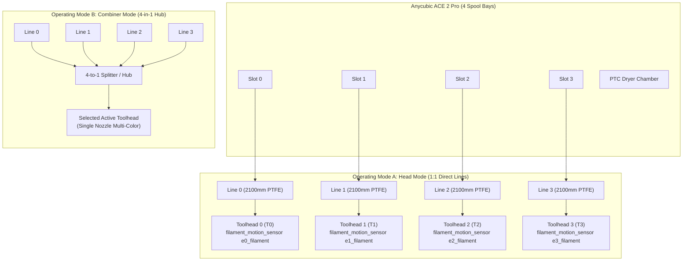

# Snapmaker U1 Multi-Head Integration Guide

An authoritative engineering and configuration guide for operating the **Anycubic ACE 2 Pro** with the **Snapmaker U1** multi-toolhead 3D printer running **SnapmakerU1-Extended-Firmware**, **multiACE**, and **ACE Control Deck**.

> [!IMPORTANT]
> ### Core Architecture Prerequisite: `SnapmakerU1-Extended-Firmware` & `multiACE`
> The Snapmaker U1 requires the community open-source custom firmware overlay ([`SnapmakerU1-Extended-Firmware`](https://github.com/Simon-CR/SnapmakerU1-Extended-Firmware)) and the [`multiACE`](https://github.com/decay71/multiACE) backend driver module.
> 
> Unlike single-nozzle printers that swap filament through a 4-to-1 merger, the Snapmaker U1 features **4 physical, independent toolheads** mounted on a carriage docking rack.

---

## 1. Architectural & Kinematic Overview

The Snapmaker U1 represents a fundamentally different multi-material architecture than single-hotend CoreXY machines (such as the Voron Trident):

| Architectural Dimension | Voron Trident 300 (Single-Toolhead Combiner) | Snapmaker U1 (Multi-Toolhead Toolchanger) |
|---|---|---|
| **Hotends / Extruders** | 1 single shared hotend & dual-drive extruder | **4 independent physical toolheads** (`T0`–`T3`), each with dedicated heater, nozzle, and extruder |
| **Toolchange Mechanism** | Filament cut, retract to hub, feed new strand, purge 45–80mm | **Carriage docking / undocking**: carriage picks up active head, drops off inactive head |
| **Purge / Waste Volume** | Significant (purge tower / bucket required for color flush) | **Near Zero**: No filament purging between swaps (only nozzle prime/wipe on initial load) |
| **Tip Management** | Mechanical blade cut (CROSSBOW) or thermal tip shaping | **Anti-Ooze Retraction**: Extruder retracts 2–4mm inside nozzle before docking; no blade cutter |
| **Simultaneous Materials** | Limited to materials with compatible print temperatures | **Heterogeneous**: PLA, TPU, PETG, and PVA/Support can print simultaneously on dedicated heads |



---

## 2. The Two Operating Modes in multiACE on U1

`multiACE` natively supports two distinct operational modes on the Snapmaker U1 platform:

### Mode A: Head Mode (1:1 Direct Dedicated Lines — Recommended)
- **Path Geometry**: Four independent reverse Bowden lines (approximately **2100 mm** each) route directly from ACE 2 Pro ports 0, 1, 2, and 3 to toolheads `T0`, `T1`, `T2`, and `T3`.
- **Zero Junction Collisions**: Because there is **no 4-to-1 merger hub**, strands never cross or collide. Each ACE feeder acts as an independent motorized buffer assist for its designated toolhead.
- **Sensor Mapping**: Each line uses the Snapmaker U1's native optical/rotary toolhead runout sensor:
  - Toolhead 0: `filament_motion_sensor e0_filament`
  - Toolhead 1: `filament_motion_sensor e1_filament`
  - Toolhead 2: `filament_motion_sensor e2_filament`
  - Toolhead 3: `filament_motion_sensor e3_filament`
- **Toolchange Execution**: Toolchanging does not retract filament from the toolhead. Instead, the motion system executes a toolhead dock/undock macro sequence while filament remains permanently staged inside the hotend.

### Mode B: Combiner Mode (4-in-1 Splitter)
- **Path Geometry**: Four lines from the ACE 2 Pro converge into an external 4-to-1 merger/splitter before routing into a single primary toolhead.
- **Use Case**: Allows printing 4 colors or materials on a single toolhead slot while reserving the other 3 toolheads for dedicated support materials or specialty nozzles.
- **Requirements**: Requires a hub switch sensor (`filament_switch_sensor hub_detect`) mounted at the merger cone to establish the 50mm pre-hub park datum for `ACE_LANE_NORMALIZE`.

---

## 3. Hardware Sensor Topology on Snapmaker U1

Unlike the Voron Trident Tier 3 architecture (which uses entry and postgear microswitches alongside a blade cutter), the Snapmaker U1 utilizes **motion/encoder sensors** integrated into each toolhead:

```
Snapmaker U1 Sensor Architecture:
  • Head 0: [filament_motion_sensor e0_filament]
  • Head 1: [filament_motion_sensor e1_filament]
  • Head 2: [filament_motion_sensor e2_filament]
  • Head 3: [filament_motion_sensor e3_filament]
```

### Sensor Configuration (`printer.cfg` snippet)

```ini
# Toolhead 0 Motion Sensor
[filament_motion_sensor e0_filament]
detection_length: 5.0
extruder: extruder
switch_pin: ^PE9
pause_on_runout: False
runout_gcode:
    M118 [RUNOUT] Head T0 runout detected!
    _ACE_ON_RUNOUT HEAD=0

# Toolhead 1 Motion Sensor
[filament_motion_sensor e1_filament]
detection_length: 5.0
extruder: extruder1
switch_pin: ^PE10
pause_on_runout: False
runout_gcode:
    M118 [RUNOUT] Head T1 runout detected!
    _ACE_ON_RUNOUT HEAD=1

# (Repeated for e2_filament and e3_filament on respective extruder pins)
```

---

## 4. Multi-Stage Loading & Hot Seat Press (`seat_overshoot_length`)

Because the Snapmaker U1 Bowden path spans ~2100 mm from the ACE unit to the carriage, loading requires multi-stage velocity profiles and a final **hot seat press**:

```
[ ACE Bay ]  === 90 mm/s ===>  [ Bowden Transit ~2000mm ]  === 25 mm/s ===>  [ Sensor Trip ]  === 15 mm/s ===>  [ Hot Seat Press +30mm ]
```

1. **Bulk Bowden Transit (90 mm/s)**: Fast forward traversal through the 2100 mm PTFE tube.
2. **Sensor Deceleration (25 mm/s)**: Upon approaching the calibrated length, velocity slows to prevent over-driving before sensor contact.
3. **Sensor Trip Handover**: `filament_motion_sensor e{n}_filament` registers filament presence.
4. **Hot Seat Press (`seat_overshoot_length`)**:
   - The extruder motor engages while hotend is heated to target temperature.
   - The ACE feeder continues driving filament with an intentional overshoot:
     ```ini
     # In ace.cfg
     seat_overshoot_length: 30  # Millimeters of overshoot into melt zone
     ```
   - This ensures the cold strand firmly seats against the nozzle orifice and displaces any air gap, preventing cold under-extrusion on the initial layer.

---

## 5. Toolchange Macro Shimming for Snapmaker U1

In Head Mode, `T0`–`T3` commands do **not** retract filament through the Bowden tube. Instead, they command the physical toolhead changer to dock the current head and pick up the new head:

```ini
# =========================================================================
# SNAPMAKER U1 TOOLCHANGE SHIMS
# =========================================================================

[gcode_macro T0]
description: Select Head 0
gcode:
    _U1_TOOLCHANGE HEAD=0

[gcode_macro T1]
description: Select Head 1
gcode:
    _U1_TOOLCHANGE HEAD=1

[gcode_macro T2]
description: Select Head 2
gcode:
    _U1_TOOLCHANGE HEAD=2

[gcode_macro T3]
description: Select Head 3
gcode:
    _U1_TOOLCHANGE HEAD=3

[gcode_macro _U1_TOOLCHANGE]
gcode:
    
    

    
        M118 [U1] Switching Toolhead: T{cur_head} -> T{next_head}
        
        # 1. Anti-ooze retraction on current head before docking
        
            SAVE_GCODE_STATE NAME=STATE_ANTI_OOZE
            M83
            G1 E-3.0 F2400
            RESTORE_GCODE_STATE NAME=STATE_ANTI_OOZE
        

        # 2. Native Snapmaker carriage dock/undock sequence
        _SELECT_TOOL TOOL={next_head}

        # 3. Prime un-retraction on newly picked head
        SAVE_GCODE_STATE NAME=STATE_PRIME
        M83
        G1 E2.8 F2400
        RESTORE_GCODE_STATE NAME=STATE_PRIME
        
        M118 [U1] Head T{next_head} active and primed.
    
```

### Action Templates Configuration in ACE Control Deck

To control Snapmaker U1 slots from the ACE Control Deck UI:

1. Open the **Settings Modal** (Gear icon).
2. Configure the **Action Templates**:
   - **Load Template**: `A_LOAD SLOT={slot}` or `T{tool}`
   - **Unload Template**: `A_UNLOAD SLOT={slot}`
   - **Purge Macro**: `PURGE`
   - **Nozzle Wipe**: `CLEAN_NOZZLE`
3. Click **Save Settings**. The deck will immediately dispatch native U1 head loading and eject operations.

---

## 6. Coexistence with multiACE Web UI

On the Snapmaker U1, the lightweight `multiACE` FastAPI web dashboard runs on port `7126` (`http://<printer-ip>:7126/multiace/`), while `ACE Control Deck` runs under `/acedeck/` (port 7125). Both interfaces operate in complete harmony, allowing you to monitor slot telemetry and thermal roasting from either dashboard without conflict.
